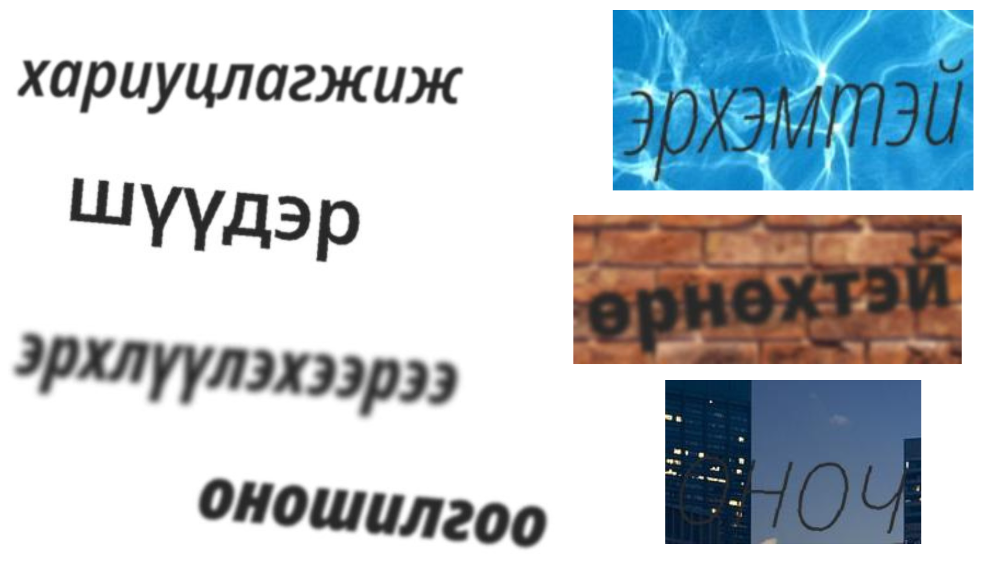

# BolorSoft-OCR
Bolorsoft Hiring Process - Practical Exam (Started: 2024/06/29 afternoon, Finished: 2024/06/30 early in the morning)

Үндсэн даалгавар бол Монгол хэлний OCR 7 хоногийн хугацаанд хийх байсан. Би дараах төлөвлөгөөний дагуу уг даалгаврыг гүйцэтгэсэн:
- [x] Assume Ideal Condition: Жигд гэрэлтүүлэгтэй, цагаан дэвсгэртэй, урд нь саад хийсэн зүйл байхгүй гэх мэт
- [x] Generate Synthetic Data for Recognition: Тэмдэгт таних модел сургахад зохиомлоор өгөгдөл үүсгэх
    - [x] Ашиглах үгсийн сан - eduge news dataset: Галигаар бичигдсэн үг, линк, тэмдэгт гэх мэт зүйлсийг устгаж цэвэрлэх
- [x] Эхний ээлжинд дан ганц тэмдэгт танихад гол анхаарлаа төвлөрүүлэх
- [x] Ideal condition assumption доор tesseract ашиглан тэмдэгт ялгах
- [ ] Дээр үүсгэсэн өгөгдлийг ашиглан тэмдэгт ялгах өгөгдөл зохиомлоор үүсгэх (Not high priority at the moment)
- [x] Нийт ажлаа цэгцлэх
    - [x] Бага сага documentation бичих
    - [x] Сургалтын өгөгдлөө [Kaggle](https://www.kaggle.com/datasets/temuujinerdene/lmbd-mn-data) руу шидэх
- [ ] Майл илгээх

## Synthetic data
Өгөгдөл зохиомлоор үүсгэхийн тулд [TextRecognitionDataGenerator](https://github.com/Belval/TextRecognitionDataGenerator)-г ашигласан. Уг tool-г ашиглахад Монгол фонт хэрэгтэй тул [Noto Sans фонт](https://fonts.google.com/noto/specimen/Noto+Sans?noto.query=mongolian&noto.lang=mn_Cyrl&noto.script=Cyrl) татаж ашигласан.

### Өгөгдлийн мэдээлэл
### Training

| № | Цагаан дэвсгэртэй | Эсэн шидийн зурагтай дэвсгэртэй |
|-----------------------|---------------------------------|
| A | 30000             | 30000                           |
| B | 50000             | 50000                           |

### Test

| № | Цагаан дэвсгэртэй | Эсэн шидийн зурагтай дэвсгэртэй |
|---------------------- |---------------------------------|
| A | 300               | 300                             |
| B | 1500              | 1500                            |

Үгийн сан: [eduge](https://github.com/tugstugi/mongolian-nlp/blob/master/datasets/eduge.csv.gz) дотроос дан ганц улс төр ангилалыг ашигласан.

## Recognition
[Text Recognition](deep-text-recognition-benchmark) repo-г ашиглан крилл үсэг ялгах модел finetune хийсэн. 
1. [cyrillic_g2.pth](https://drive.google.com/uc?id=1PIywV9_WZqNNfUIk6-bs598fX7OZTcbY) модел дээр сургалтын `A` хэсгийг ашиглаж туршиж үзсэн. 

    1.1. Нийт 10 epoch сургасны үр дүнд дараах байдалтай [байсан](saved_models\eduge_news_uls_tur_words_cyrillic_g2_v1\log_train.txt):

        | Ground Truth | Prediction   | Confidence Score & T/F |
        |--------------|--------------|------------------------|
        | ахлөх        | дулэу        | 0.0143 False           |
        | семийн       | гѓкжйн       | 0.1124 False           |
        | сольё        | гтйъд        | 0.0247 False           |
        | дээрдүүлэн   | дээргуауйэл  | 0.0019 False           |
        | тесо         | үржъ         | 0.0009 False           |

    1.2. Нийт 150 epoch сургасны [дараагаар](saved_models\eduge_news_uls_tur_words_cyrillic_g2_v2\log_train.txt):
    
        | Ground Truth   | Prediction     | Confidence Score & T/F |
        |----------------|----------------|------------------------|
        | цонжинболдог   | цонкинболдог   | 0.0295 False           | 
        | доромжлуулаад  | доэоүхлуулаад  | 0.0656 False           |
        | үнэлэх         | үнэлэх         | 0.9743 True            |
        | хэсгийнхэнд    | хэсгийнхэнд    | 0.2898 True            |
        | дарангуйллыг   | аатугиө        | 0.0000 False           |

    [Test Accuracy (A)](result\Ground_BolorSoft-OCR_deep-text-recognition-benchmark_saved_models_eduge_news_uls_tur_words_cyrillic_g2_v2_best_accuracy.pth\log_evaluation.txt): 15.500

2. Дээрх моделийг сургалтын `B` хэсгийг ашиглан 1000 epoch сургасны [дараагаар](saved_models\eduge_news_uls_tur_words_cyrillic_g2_v3_single_word\log_train.txt)

| Ground Truth   | Prediction     | Confidence Score & T/F |
|----------------|----------------|------------------------|
| шийдевэрлэжээ  | шийдввэрлэжээ  | 0.4727 False           |
| хэтэрчихээд    | хэтэрчихээд    | 0.5595 True            |
| амралтаараа    | амралтаараа    | 0.6647 True            |
| нийцэхүйц      | нийцэхүйц      | 0.6271 True            |
| хумигдсанаас   | хумигдсанаас   | 0.2758 True            |

[Test Accuracy (B)](result\Ground_BolorSoft-OCR_saved_models_eduge_news_uls_tur_words_cyrillic_g2_v3_single_word_best_accuracy.pth\log_evaluation.txt): 77.867

Сургалт хийхэд [ашиглах параметрүүд](mn_conf\train_parameters_conf.yaml) `mn_conf` фолдер дотор байгаа. Мөн сургалт [хийхэд](trivial\mics_cmi.txt):

`python deep-text-recognition-benchmark/demo.py --demo_conf mn_conf/demo_parameters_conf.yaml`

## Tesseract
Цагаан дэвсгэртэй үед tesseract ашиглан зургаас Монгол тэмдэгтүүдийг ялгасан.

Дараагаах нь тэмдэгт бүрд танилт хийсэн.

# Notebooks
1. [clean_eduge_news](clean_eduge_news.ipynb) - Eduge news цэвэрлэж, ашиглах үгсийн сан бэлтгэсэн
2. [generate_mn_synth_data](generate_mn_synth_data.ipynb) - Зохиомол өгөгдөл болон label үүсгэх
3. [test_model_on_small_subset](test_model_on_small_subset.ipynb) - [var_small](mn_recognition_data\val_small) болон [demo_multiple_word](mn_recognition_data\demo_multiple_word) жишээ өгөгдлийг ашиглан моделийн гүйцэтгэлийг танилцуулах
4. [detect_and_recognize_mn](detect_and_recognize_mn.ipynb) - Цагаан дэвсгэртэй зургаас Tesseract ашиглан тэмдэгт ялгаж, дарагаар нь таних.
